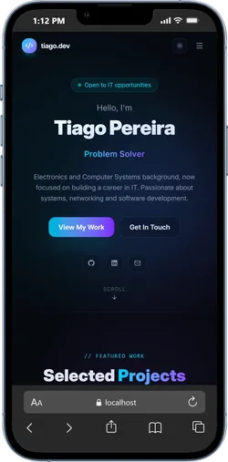
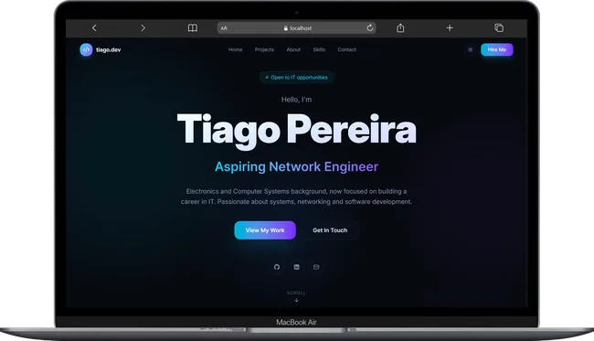

# Tiago Pereira — Portfolio

Personal portfolio showcasing my web projects, CCNA-focused homelab work, technical background, and professional goals in networking and security systems.

## Table of contents

- [Overview](#overview)
  - [Screenshot](#screenshot)
  - [Links](#links)
- [My process](#my-process)
  - [Built with](#built-with)
  - [What I learned](#what-i-learned)
  - [Continued development](#continued-development)
  - [Useful resources](#useful-resources)
- [Author](#author)
- [Acknowledgments](#acknowledgments)

## Overview

### Screenshot

**Mobile Version**

**Laptop Version**

### Links

- Solution URL: [GitHub repository](https://github.com/BuildAndBreak/Portfolio)
- Live Site URL: [Portfolio](https://portfolio-tiagopereira.netlify.app)

## My process

### Built with

- [React](https://reactjs.org/) - JS library
- [TypeScript](https://www.typescriptlang.org/) - Type-safe JavaScript
- [Vite](https://vite.dev/) - Build tool and development server
- [Tailwind CSS](https://tailwindcss.com/) - Utility-first styling
- [Motion](https://motion.dev/) - Interface animations

### What I learned

This project focuses on strengthening my TypeScript skills through typed React components, reusable data models, and safer state management.

I also learned to create purposeful interface animations with Motion, including section reveals, hover feedback, and interactive project cards.

The project also reinforced the importance of optimizing image assets and keeping the interface consistent across screen sizes.

### Continued development

I want to continue improving my TypeScript knowledge through stricter types and reusable interfaces, while refining accessible and performant interface animations.

### Useful resources

- [React documentation](https://react.dev/) - Reference for component design and state management.
- [Tailwind CSS documentation](https://tailwindcss.com/docs) - Reference for responsive styling and utility classes.
- [Motion documentation](https://motion.dev/docs/react) - Reference for page and component animations.

## Author

- Website - [Portfolio](https://portfolio-tiagopereira.netlify.app)
- Frontend Mentor - [@BuildAndBreak](https://www.frontendmentor.io/profile/BuildAndBreak)
- Linkedin - [Tiago Pereira](https://www.linkedin.com/in/tiago-pereira-5a4698289/)
- Github - [@BuildAndBreak](https://github.com/BuildAndBreak)

## Acknowledgments

Thanks to the React, Tailwind CSS, and Motion communities for the documentation and tools that support this project.

Thanks to the networking and security-systems communities for the resources that support my continued technical development.
